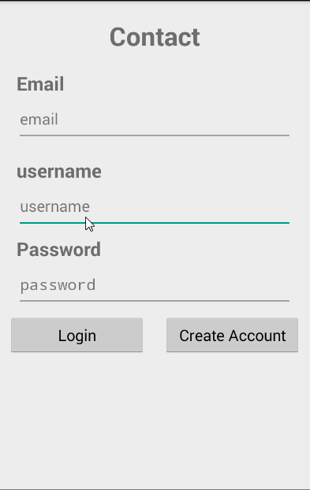
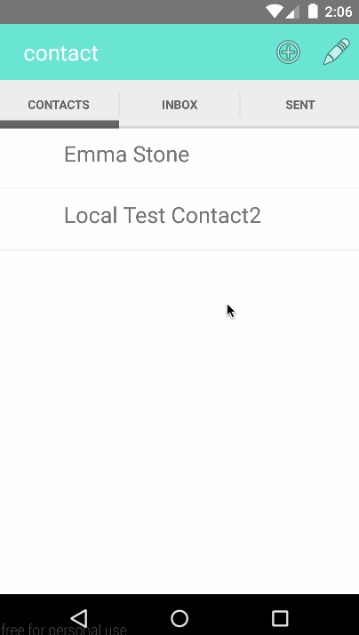
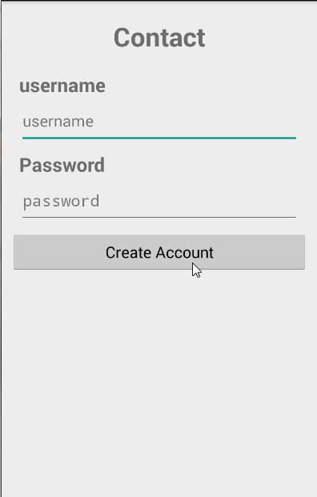

# contact
Let your contacts update their contact info in your address book so you don't have to.

## User stories
 * [x] Create an account 
	* [x] Allow user to create user name and password
	* [ ] Display AccountPicker (optional)
	* [ ] Request permissions to read/write user's Google Contacts and aquire Google OAuth token  (optional)
	* [x] Create Parse account for user
	* [x] Store Parse login info in shared preferences for future logins
 * [x] Create your profile
   * [x] Allow user to upload photo
   * [x] Allow user to enter name, phone#, email, address, etc.
   * [x] Allow user to enter social media profiles, web sites, etc
 * Display Contacts
   * [x] Display contacts in list view
   * [x] Display invites to connect
   * [x] Display list of people user has sent invites to
   * [x] Display detail view on click (optional)
   * [x] Display contact's photo
   * [x] Allow user to call or email contact by clicking their phone number or email
   * [x] Swipe refresh for lists
   * Allow user to filter contacts by group (based on profile type) (optional)
   * Allow user to sort by frequently contacted or recently contacted (optional)
 * Contact management
   * [x] Accept/Decline an invite to share info
   * [x] Revoke or delete a connection (optional)
   * Share your profile via email or text (optional)
   * Share via QR code (advanced)
   * Build "business card" widget for easy sharing  (advanced)
   * Propose connections based on users in native address book using Contact (advanced)
 * Data management
   * [x] Read contacts from native address book
   * [x] Store created profile in parse
   * Push updates to Contact and native address book (via google contacts) (optional)
 * Allow user to message other users (advanced)
 * User acquisition
   * Invite friends via Facebook, Twitter or other social media (optional)
   * Offer to send messages to all of the contacts in their address book (optional)
 * Location Aware Phone redirecting
   * Send your calls to a number based on where you are (advanced)
   
[Wireframes](http://contactpush.github.io./)

## Walkthrough of User Stories
## Sprint 2

## Sprint 1

Login walkthrough:

GIF created with [LiceCap](http://www.cockos.com/licecap/).